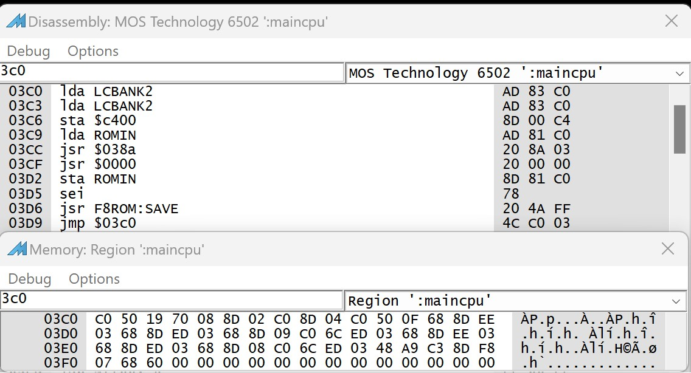

# Tracing the boot process..

We can run mame with this command line:

`mame apple2e -sl4 softcard -aux ext80 -flop1 <PathToDiskImages>\DiskImages\BlankBootableCPM3.nib -debug`

Pressing `F6` will run mame to the first Z80 access, at this point a regular CPMLDR is in memory at `$2100` (6502) and `1100H` (Z80). There seems to be code loaded in front of it at $1100, source code to a Caldera Inc branded version from the Unoffical CPM site original zip [here](http://www.cpm.z80.de/download/cpm3_src.zip)

We leave the original boot sector and have what looks like the 6502 bits of a BIOS in the language card at $D000 and the CPM Loader ready to run.

On the first change to the Z80 the $300 range looks like this in the mame debug windows



Lets put a break point at $090a in the 6502 space

`090a: 4c c0 03     START_Z80       jmp     $03c0``
 
 Then hit `F5` to run that far.

## Apple II vectors

These are some Apple //e vectors in the $300-$3ff range. At this point we don't have code at $38a that
saves the 6502 registers. Time to figure out how it gets there and what our mini BIOS stuff does.

| Addr | Usage |
|------|-------|
| $3C0 | call Z80 |
| $3D0 | Address of 6502 routine to call |
| $3F0 | Break routine |
| $3F2 | Reset routine |
| $3F4 | Reset checksum |
| $3F5 | JMP to ampersand routine for AppleSoft |
| $3F8 | JMP to Ctrl-Y for monitor |
| $3FB | JMP for NMI |
| $3FE | IRQ vector |

So how does the CPMLDR code work, there are a couple of interesting things we can look at, the CPMLDR code looks like this z80 mnemnomics with the 8080 ones in comments:
```
1100: 31 81 12 ld   sp,$1281    ;lxi	sp,stackbot
; first call is to Cold Boot
1103: CD 00 1B call $1B00   ;call	bootf
; Initialize the System
1106: 0E 0D    ld   c,$0D   ;mvi	c,resetsys
1108: CD 8D 12 call $128D   ;call	bdos
; print the sign on message
110B: 0E 09    ld   c,$09   ;mvi	c,printbuf
110D: 11 25 12 ld   de,$1225;lxi	d,signon
1110: CD 8D 12 call $128D   ;call	bdos
```

The cold boot call at 1100H is to the start of the BIOS jump table, we can dump this out with `dasm SmallBIOSjumpTable.asm,1b00,57`

A lot of the jumps are 
```ld a,$00
ret
```
which is basically a null operation. The ones we're interested are defined at the end of the CPMLDR.ASM

```
1B00: C3 57 1B jp   $1B57 // 00. Cold boot
1B03: C3 57 1B jp   $1B57 // 01. Warm boot
1B0C: C3 B8 1F jp   $1FB8 // 04. console output function
1B18: C3 D5 1F jp   $1FD5 // 08. disk home function
1B1B: C3 CB 1F jp   $1FCB // 09. select disk function
1B1E: C3 D8 1F jp   $1FD8 // 10. set track function
1B21: C3 7F 20 jp   $207F // 11. set sector function
1B24: C3 E1 1F jp   $1FE1 // 12. set dma function
1B27: C3 E6 1F jp   $1FE6 // 13. read disk function
1B30: C3 C8 1F jp   $1FC8 // 16. sector translate
1B4B: C3 84 20 jp   $2084 // 25. memory move function
```

