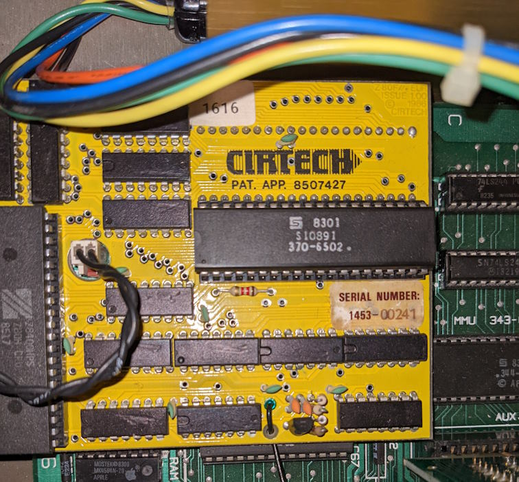

# Cirtech CP/M plus disassembly.
Analysis of the Cirtech Apple //e CP/M plus code, basically the repo where I add
various disk images and disassemblies while I work on the code. Currently the disk images do NOT boot
in eiher mame or AppleWin this is the first thing to fix.

The Cirtech card looks like this installed in a Apple //e:

## Why?
Well I'd like to port CP/M plus to the RC2014 system. With most of the source code being available 
via [The Unoffical CP/M Web site](http://www.cpm.z80.de/) along with various bits of build process
this feels like an achievable aim.

As an initial host system I'd like to use the Cirtech CP/M plus system running in an emulator to act as a build environment.
This should mean once completed the build process can be self hosted on a RC2014 system.

## Folders

[Disassembly](Disassembly/README.md) contains notes and various chunks of  disassembled code used to create the source code.

[src](src/README.md) Source code and powershell scripts to build them.

[DiskImages](DiskImages/README.md) Misc disk images created on the Apple //e

[images](images) contains jpegs \ png files used for readme files.

[Tools](Tools/README.md) tools, some in dotnet 8.0, some that run in CP/M

## Copyrights
Any code that I generate will be MIT licensed.
The remaining code is either copyrighted by Cirtech Ltd or Digital Research Inc (or their successors). 
Hopefully this won't cause any issues, but I do not have permission for the Cirtech code (see the Unofficial CP/M website for the DRI code).
