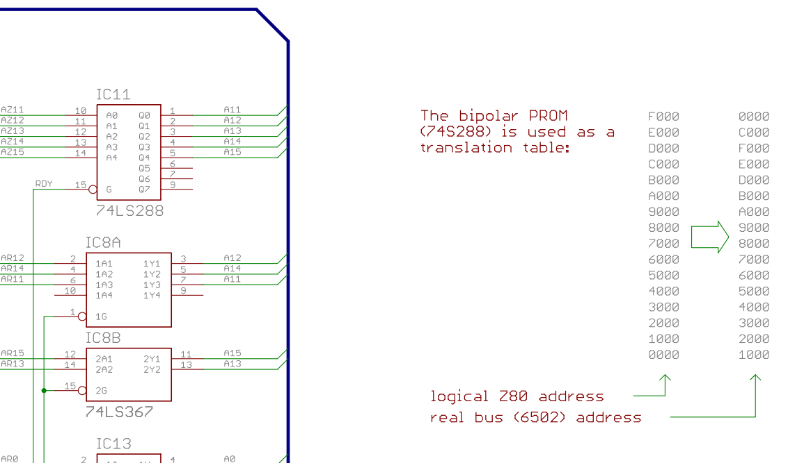
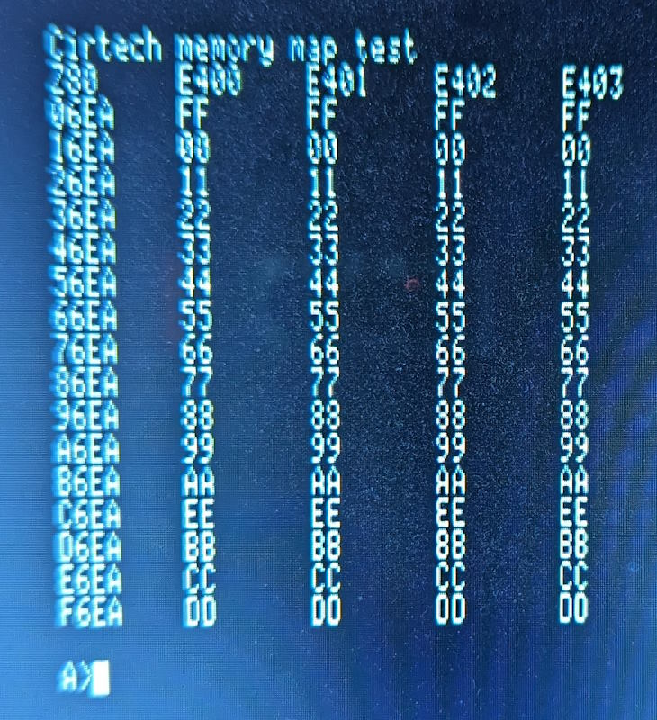
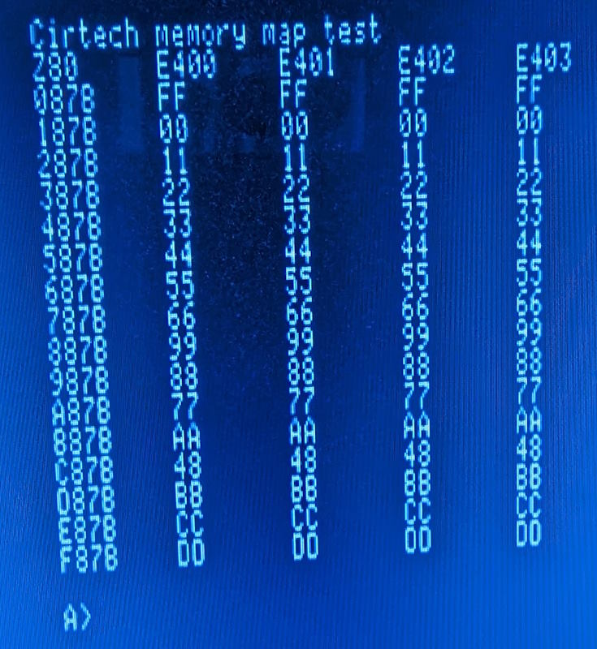

# Cirtech Apple //e address map

The Cirtech CP/M card uses a 74LS288 PROM for it's address mapping from the Z80 side to the 6502 side. I managed to find this [page](http://john.ccac.rwth-aachen.de:8000/patrick/schematics.htm) by Dr. Patrick Schäfer which has a schematic for the Apple //c version of the //e card I have (the link is at the bottom of the page).

The address map on the schematic is incomplete.



The CP/M plus software has checks in the BIOS for the address mapping, when calling from the Z80 side it uses a different address for the write that swaps to the Z80 side.

In order to test this on real hardware, some Z80 code was written to save 16 values from the memory stepping by `1000H` increments. The code then overwrites these locations with a value where both nibbles are the same as the 4K page.

The first value chosen was with an offset of `$C6EA` or `0E6EAH` which happens to contain the value `EE`. When this was run with transferring to the 6502 side by writes to `E400`, `E401`, `E402` and `E403` the map from Z80->6502 addresses didn't change. A picture of the screen after running is shown below:



This showed that for this particular variant of the Cirtech card the address used to swap between the Z80 and 6502 processors didn't matter.

Then addresses used to test for the prescence of the card in the BIOS happen to have the address line A11 high, so the test address was changed to have A11 high which then showed the following address map.



Addresses in the range `07800H`-`07FFFH` and `09800H`-`09FFFH` from the Z80 side are swapped by the 74LS288 32 byte PROM when A11 is high.

It seems possible the different card address writes for E401 etc are for a different card than the Apple //e card which gives the same address mapping effect.

## 6502 to Z80 Address map

| 6502 | Z80  | Notes |
|------|------|-------|
| 0000 | F000 | |
| 1000 | 0000 | |
| 2000 | 1000 | | 
| 3000 | 2000 | |
| 4000 | 3000 | |
| 5000 | 4000 | |
| 6000 | 5000 | |
| 7000 | 6000 | |
| 8000 | 7000 | |
| 8800 | 9800 | Swapped with A800-AFFF | 
| 9000 | 8000 | |
| A000 | 9000 | |
| A800 | 7800 | Swapped with 8800-8FFF |
| B000 | A000 | |
| C000 | E000 | |
| D000 | B000 | |
| E000 | C000 | |
| F000 | D000 | |

## Z80 to 6502 mapping

|  Z80 | 6502 | Notes |
|------|------|-------|
| 0000 | 1000 | |
| 1000 | 2000 | |
| 2000 | 3000 | | 
| 3000 | 4000 | |
| 4000 | 5000 | |
| 5000 | 6000 | |
| 6000 | 7000 | |
| 7000 | 8000 | |
| 7800 | A800 | Swapped with 9800-9FFF | 
| 8000 | 9000 | |
| 9000 | A000 | |
| 9800 | 8800 | Swapped with 7800-7FFF | 
| A000 | B000 | |
| B000 | D000 | |
| C000 | E000 | |
| D000 | F000 | |
| E000 | C000 | |
| F000 | 0000 | |

## Address map

ASCII line art memory map.

```
Cirtech CPM memory map 

6502  Z80                          Main memory               Aux memory
                              +------------------------+------------------------+
1000  0000                    |  JP to CPMLDR          |  JP to Warmboot        |
1005  0005                    |                        |  JP to BDOS            |
1100  0100                    |  Copy of CCP           |  CP/M TPA              |
1E00  0E00                    |  Toolkey messages      |                        |
2100  1100                    |  CPMLDR                |                        |
3000  2000                    |  CPMLDR                |                        |
3100  2100                    |  CPMLDR                |                        |
4000  3000                    |  0E00H-5E00H used for  |                        |
5000  4000                    |  Disk duplicate        |                        |
6000  5000                    |                        |                        |
6DBC  5DBC                    |  DPB x 4 (044H)        |                        |
                              |  (DPB copied to DE6CH) |                        |
6E00  5E00                    |  DRVTBL                |                        |
6E20  5E20                    | Map from CPM letters to|                        |
                              | Apple Drives Slot,Drv  |                        |
7000  6000                    |                        |                        |
8000  7000                    |   CP/M Disk buffers    |                        |
8400  7400                    |                        |                        |
8600  7600                    |  Banked BDOS           |                        |
8800  9800  (Swapped address) |  Banked BDOS           |                        |
9000  8000                    |  Banked BDOS           |                        |
A000  9000                    |  Banked BDOS           |                        |
A800  7800  (Swapped address) |  Banked BDOS           |                        |
B000  A000                    |  Banked BDOS           |                        |
B400  A400                    |  Banked BIOS           |                        |
            +---LC Bank 1-----+----LC Bank 2-----------+-----LC Bank 2----------+---LC Bank 1-----+ 
D000  B000  | Video BIOS(6502)|  CP/M TPA              |   Printer buffer       |   AUX buffer    |
D400  B400  | Disk BIOS(6502) |                        |                        |                 | 
DA00  BA00  |                 |                        |                        |                 |
DE00  BE00  | Disk 6 bit data |                        |                        |                 |  
DF00  BF00  | Disk 2 bit data |                        |                        |                 |
            +-----------------+----LC 8 K Shared-------+-----LC 8 K Shared------+-----------------+
E000  C000                    |  CP/M TPA              |   Printer Buffer       |
F000  D000                    |                        |                        | 
F800  D800                    |  Resident BDOS         |                        | 
FE00  DE00                    |  Resident BIOS         |                        | 
                              +------------------------+------------------------+ 
C000  E000                    |  Apple //e onboard IO  |  Apple //e onboard IO  |
C080  E080                    |  Card slot IO          |   Card slot IO         |
C100  E100                    |  Per slot ROM          |   Per slot ROM         |
C800  E800                    |  2K card slot ROM      |   2K card slot ROM     | 
                              +------------------------+------------------------+
0000  F000                    | 6502 Zero page used    |                        |
                              | by BIOS drivers        |   Not used             |
0100  F100                    | 6502 Stack             |                        |
                              +------------------------+------------------------+
0200  F200                    | 6502 line input buffer |                        |
0300  F300                    | Misc shared Routines   | Misc shared Routines   |
                              | To From Z80 Code       | To From Z80 Code       |
                              | Softcard compatibility | Softcard compatibility |
                              +------------------------+------------------------+
0400  F400                    | Apple 80 Column Screen | Apple 80 Column Screen |
                              +------------------------+------------------------+
0800  F800                    | Disk buffer            |                        |
0A00  FA00                    | Character IO BIOS      |                        | 
0C00  FC00                    | Toolkey messages       |                        |
0F00  FF00                    | Toolkey screen save    |                        |  
                              +------------------------+------------------------+
```
