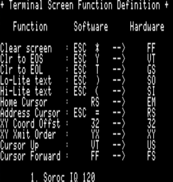
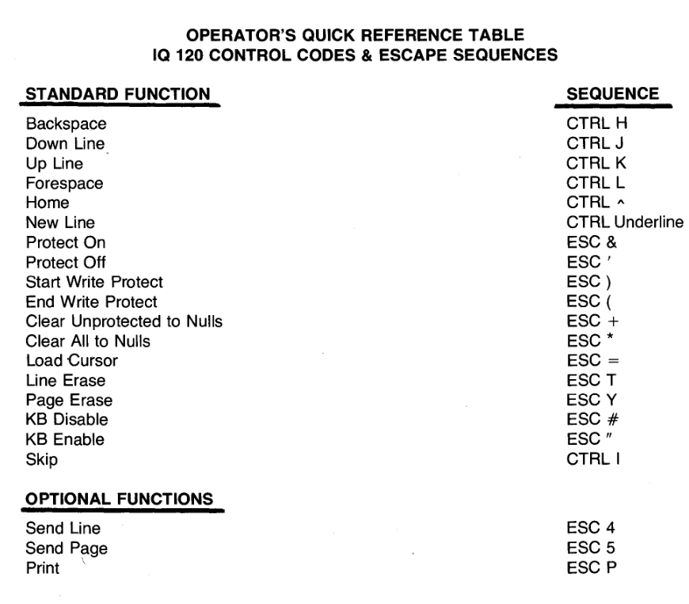

# BIOSVID.MAC patches

The video BIOS as supplied from Cirtech is a bit buggy in some interesting ways. It is a mix of Soroq IQ120 codes and the original Apple //e 80 column card escape and control codes.

The Apple //e video BIOS mostly emulates a Datamedia terminal according to the Microsoft Softcard manual. Probably an Elite 1520A era terminal, but the 1520A does not handle normal / inverse.

### Apple //e 80 column codes

| Ctrl   | Hex | Code | Function             |
|--------|-----|------|----------------------|
| Ctrl-H | $08 | BS   | Backspace            |
| Ctrl-J | $0A | LF   | Linefeed             |
| Ctrl-K | $0B | VT   | Clear to EOS         |
| Ctrl-L | $0C | FF   | Home and clear       |
| Ctrl-M | $0D | CR   | Carriage return      |
| Ctrl-N | $0E | SO   | Normal               |
| Ctrl-O | $0F | SI   | Inverse              |
| Ctrl-V | $16 | SYN  | Scroll down          |
| Ctrl-W | $17 | ETB  | Scroll up            |
| Ctrl-Y | $19 | EM   | Home                 |
| Ctrl-Z | $1A | SUB  | Clear line           |
| Ctrl-[ | $1B | ESC  | Escape               |  
| Ctrl-\ | $1C | FS   | Foward space         |
| Ctrl-] | $1D | GS   | Clear to end of line |
| Ctrl-^ | $1E | RS   | Goto X,Y             |
| Ctrl-_ | $1F | US   | Cursor up            |

## Softcard implementation

The Microsoft documentation recommends using a Siroq IQ120 terminal definition for CP/M programs as being a more common choice than the Datamedia terminal. The Microsoft softcard has tables which map from the Siroq IQ120 terminal to the Apple //e or Videx Videoterm card control codes. The screen shot below shows the codes in the `CONFIGIO.BAS` program on a Microsoft Softcard CP/M disk.

The `CONFIGIO.BAS` program sets up two tables at $396 and $3A1 which map from the software codes to codes that the 80 column in slot 3 will understand. The mapping is performed in the CP/M BIOS console IO routines.

The Cirtech BIOS does not perform this mapping and has a null table where the screen definition is a one to one mapping from Siroq to Siroq codes. What is noticable from the terminal screen function screen shot is that some codes are reused (`RS`,`VT` and `FF`).

In practice

